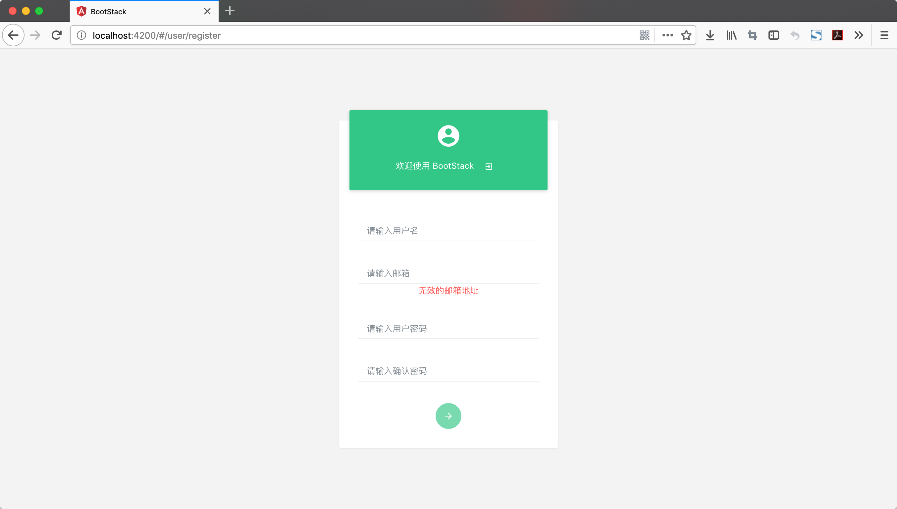
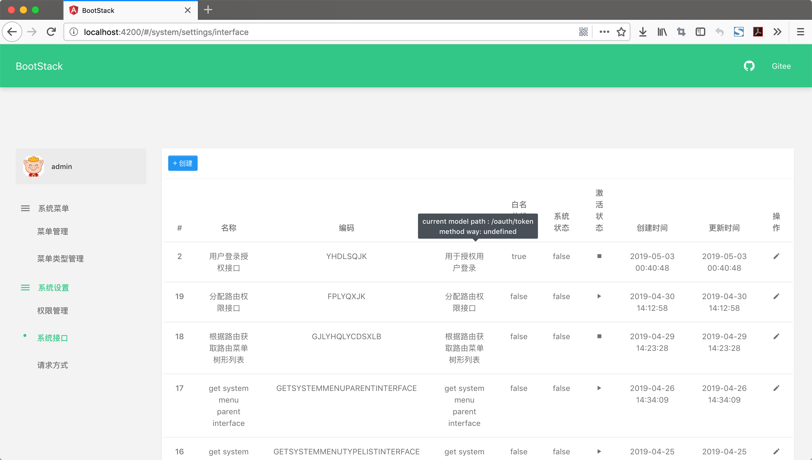
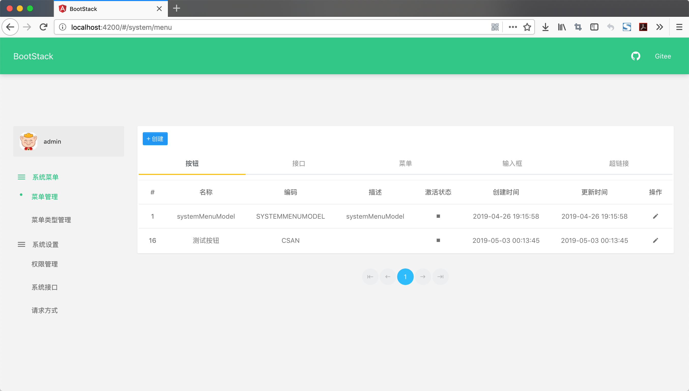
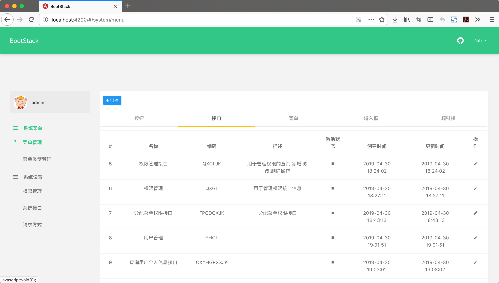
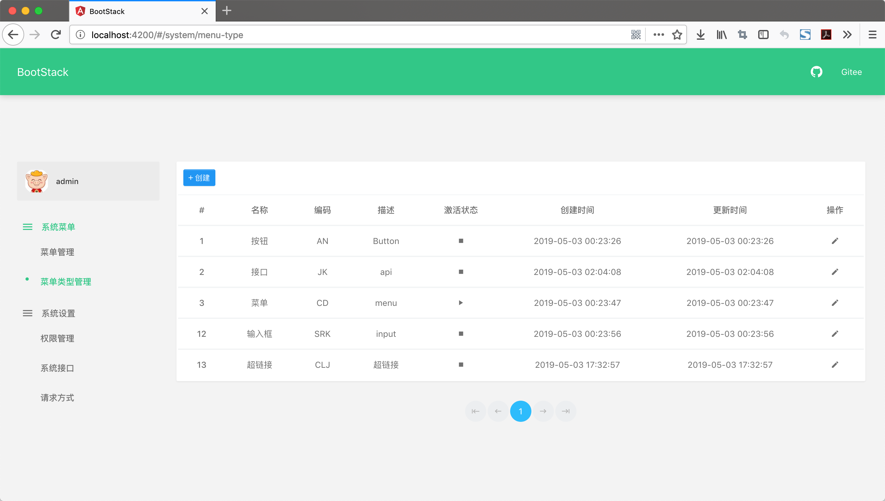
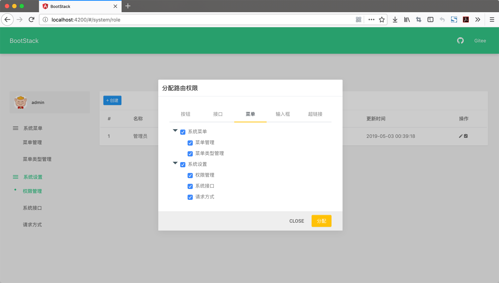

#### BootStack简介

---

BootStack是一个开源的权限管理平台。

BootStack核心使用SpringBoot进行平台的开发，使用Angular进行前端页面的展示，使用Security，Oauth2，JWT进行权限以及Rest API的校验。

BootStack也是一个SpringBoot脚手架，核心宗旨为让所有程序员拥有一套开箱即用的后台权限管理平台。

 

#### BootStack功能描述
     
---

- 菜单管理

    - 菜单管理
    - 菜单类型管理

- 系统设置

    - 权限管理
    - 系统接口
    - 请求方式

 

#### BootStack全面貌

---

- 登录页面

- 注册页面

- 接口页面

- 菜单页面

- 菜单接口页面

- 菜单类型页面

- 权限页面

- 请求方式页面

