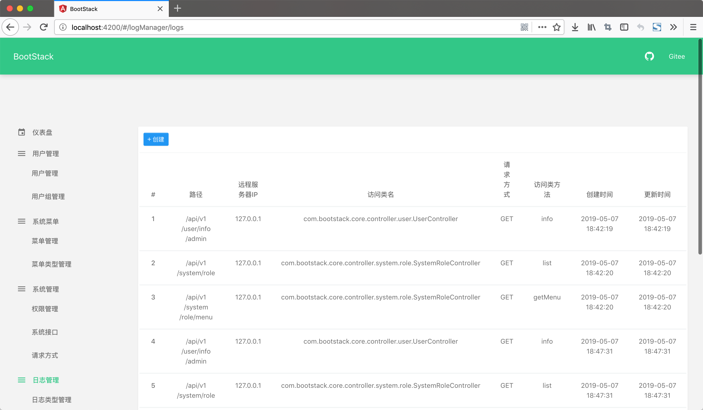
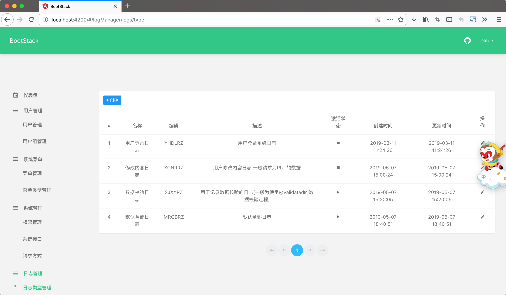
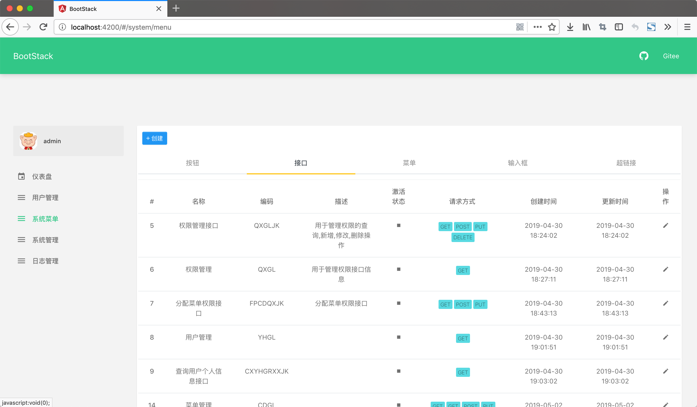
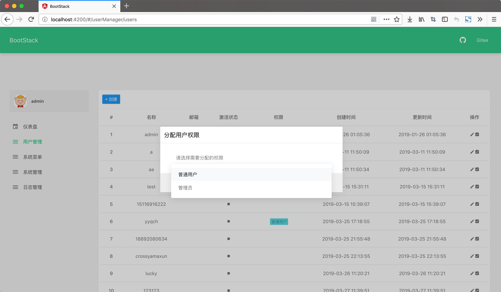

#### BootStack 1.0.1 发布了，该版本修复的BUG 包括：

---

1. [BOOTSTACK-15新建内容没有给出明确的提示信息](http://jira.ttxit.com/browse/BOOTSTACK-15)
2. [BOOTSTACK-12菜单管理选择分类后分页无法使用](http://jira.ttxit.com/browse/BOOTSTACK-12)
3. [BOOTSTACK-9新建菜单选择接口类型后父菜单类型没有根据选择的类型修改](http://jira.ttxit.com/browse/BOOTSTACK-9)
4. [BOOTSTACK-8新建菜单页面选择框与主题不协调](http://jira.ttxit.com/browse/BOOTSTACK-8)
5. [BOOTSTACK-7页面未进行国际化完整](http://jira.ttxit.com/browse/BOOTSTACK-7)
6. [BOOTSTACK-5左侧菜单无法进行单菜单跳转问题](http://jira.ttxit.com/browse/BOOTSTACK-5)
7. [BOOTSTACK-3添加到系统接口中的路径地址无法授权提示this is not active token](http://jira.ttxit.com/browse/BOOTSTACK-3)

 

#### BootStack新增功能
     
---

1. [BOOTSTACK-14审计日志类型](http://jira.ttxit.com/browse/BOOTSTACK-14)
2. [BOOTSTACK-4分配用户权限功能](http://jira.ttxit.com/browse/BOOTSTACK-4)
3. [BOOTSTACK-2审计日志](http://jira.ttxit.com/browse/BOOTSTACK-2)
4. [BOOTSTACK-1用户管理](http://jira.ttxit.com/browse/BOOTSTACK-1)

 

#### BootStack新版面貌

---

- 日志页面

- 日志类型页面

- 新菜单页面

- 分配用户路由页面

- 用户页面

