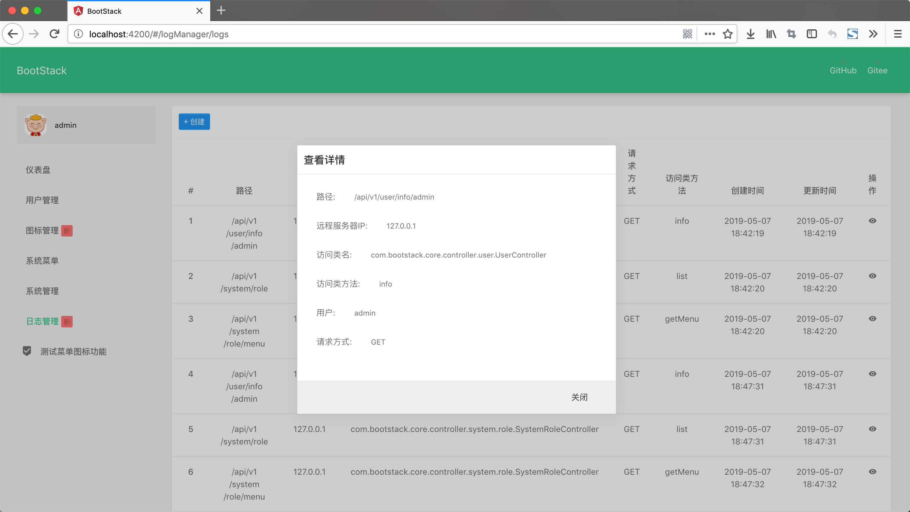
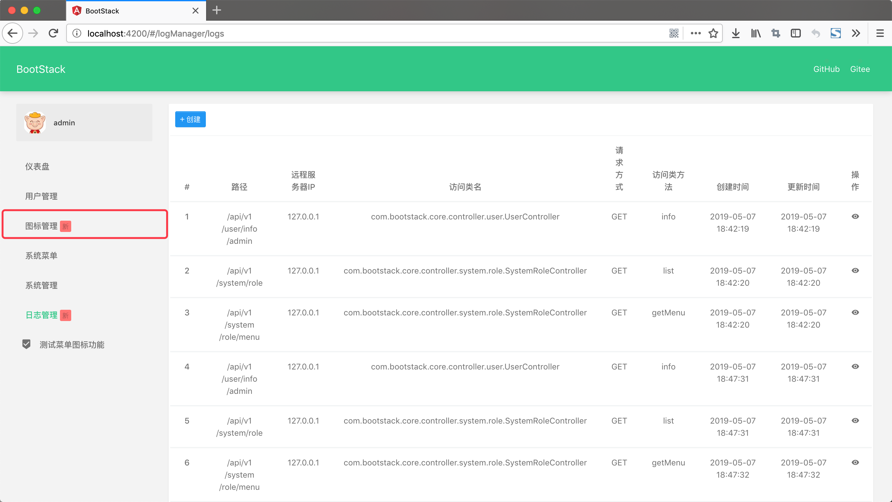

#### BootStack 1.0.2 发布了，该版本修复的BUG 包括：

---

1. [BOOTSTACK-22	无法分配菜单功能](http://jira.ttxit.com/browse/BOOTSTACK-22)
2. [BOOTSTACK-23	顶部出现空白页面](http://jira.ttxit.com/browse/BOOTSTACK-23)
3. [BOOTSTACK-21	日志管理的某条日志无法查看日志详情](http://jira.ttxit.com/browse/BOOTSTACK-21)
4. [BOOTSTACK-20	菜单的请求方式有重复的数据](http://jira.ttxit.com/browse/BOOTSTACK-20)
5. [BOOTSTACK-18	新建菜单设置了图标单页面菜单图标没有变化](http://jira.ttxit.com/browse/BOOTSTACK-18)
6. [BOOTSTACK-19	新建菜单新功能的使用位置没有具体展示](http://jira.ttxit.com/browse/BOOTSTACK-19)
7. [BOOTSTACK-17	新建菜单增加了提示信息,但是没有找到使用位置](http://jira.ttxit.com/browse/BOOTSTACK-17)
8. [BOOTSTACK-11	系统左侧菜单图标无法明确选择](http://jira.ttxit.com/browse/BOOTSTACK-11)

 

#### BootStack新增功能
     
---

1. [BOOTSTACK-24	新增图标类型管理](http://jira.ttxit.com/browse/BOOTSTACK-24)
2. [BOOTSTACK-25	新增图标用途](http://jira.ttxit.com/browse/BOOTSTACK-25)
3. [BOOTSTACK-13	增加图标库管理功能](http://jira.ttxit.com/browse/BOOTSTACK-13)

 

#### BootStack新版面貌

---

- 图标管理页面

- 图标类型页面

- 图标用途管理页面

- 日志详情页面

- 新菜单提示页面

- 新建菜单选择图标页面

