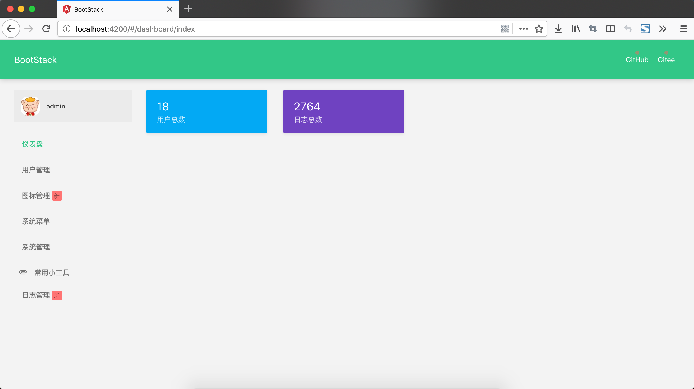

#### BootStack 1.0.3 发布了，该版本修复的BUG 包括：

---

1. [#IWS3K 菜单提示信息和菜单不符合](https://gitee.com/Spring-Stack/bootstack/issues/IWS3K)
2. [#IWDOQ 分页数据超出了页面宽度](https://gitee.com/Spring-Stack/bootstack/issues/IWDOQ)
3. [#IWDD8 新建用户的时候没反应](https://gitee.com/Spring-Stack/bootstack/issues/IWDD8)
4. [#IWDMZ 编译出错](https://gitee.com/Spring-Stack/bootstack/issues/IWDMZ)
5. [#IWAOI 左侧仪表盘功能无法使用,页面一片空白](https://gitee.com/Spring-Stack/bootstack/issues/IWAOI)

 

#### BootStack新增功能
     
---

1. 增加JSON小工具功能
2. 新增统计模块,统计仪表盘用户/日志数据

 

#### BootStack新版面貌

---

- JSON小工具页面

- 仪表盘页面

