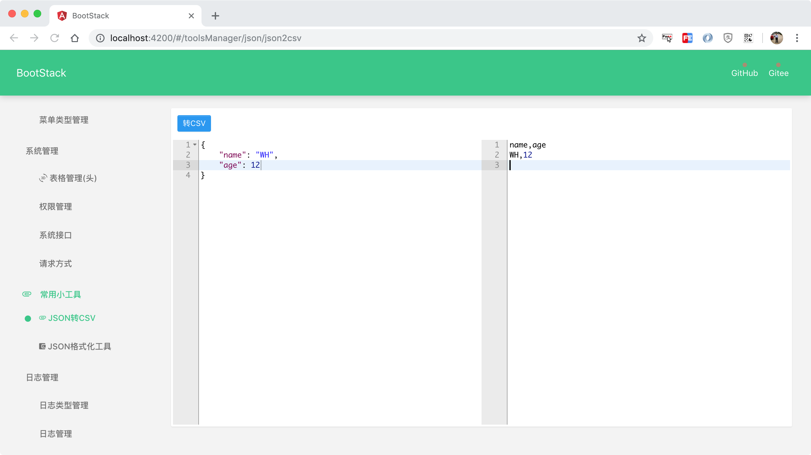

#### BootStack 1.0.4 发布了，该版本修复的BUG 包括：

---

1. 修复左侧菜单未显示完整
2. 修复格式化/压缩json数据未清空右侧编辑器内容
3. 修改菜单使用递归模式进行封装
4. 修复二级菜单未显示图标

 

#### BootStack新增功能
     
---

1. 新增用户systemed,locked,email字段用于扩展后续功能
2. 新增支持自定义表头信息
3. 支持表头管理页面动态表头
4. 支持动态表头分页功能
5. 新增JSON转CSV工具

 

#### BootStack新版面貌

---

- 动态表头

- JSON转CSV工具

