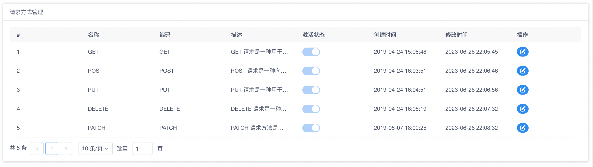
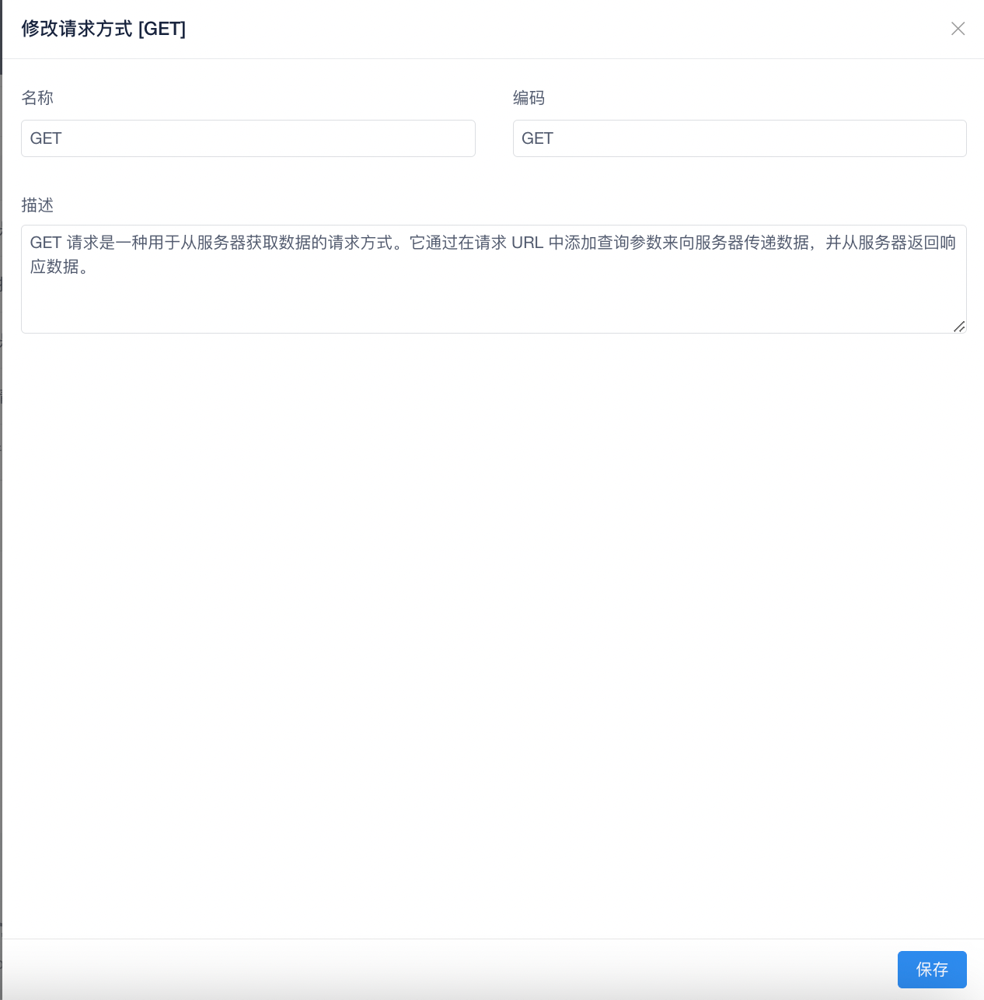

!!! note

    请求方式主要用于限制我们操作菜单，API 的 HTTP 发送方式。

菜单默认的目录为：`系统管理` → `请求方式`，点击后页面大概如下：

在页面中我们可以看到路由列表，其中表格中显示以下字段信息：

- ID
- 名称
- 编码
- 描述
- 激活状态
- 创建时间
- 修改时间
- 操作

### 修改请求方式

如果我们需要修改请求方式只需要点击需要修改数据的行操作栏中的修改按钮。点击后会出现类似如下窗口

我们填写完成数据后点击底部的 `保存` 按钮即可将数据修改。

!!! danger

    请求方式需要底层支持相关函数才会生效，系统默认启动会加载数据到系统中。

