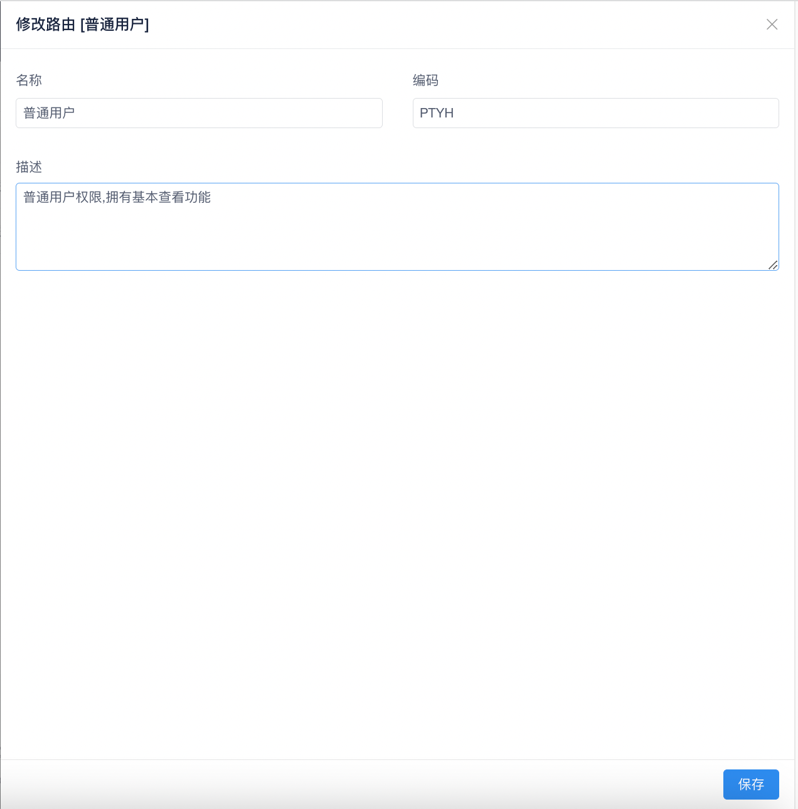

!!! note

    路由主要用于控制用户可以使用的菜单，API 等各种权限。

菜单默认的目录为：`系统管理` → `路由管理`，点击后页面大概如下：

在页面中我们可以看到路由列表，其中表格中显示以下字段信息：

- ID
- 名称
- 编码
- 描述
- 激活状态
- 创建时间
- 修改时间
- 操作

### 分配菜单

当我们点击分配菜单按钮后会弹出以下窗口：

其中在弹出框的顶部会提示我们当前是对于哪个权限进行分配菜单的操作。
默认系统中如果已经分配过后的数据在显示列表中会为选中状态。选中需要重新分配的菜单后点击底部的 `分配菜单` 按钮即可实现菜单的分配。

### 新增｜修改路由

如果我们需要新增路由，需要点击页面的右侧 `+` 号按钮，修改的话只需要点击需要修改数据的行操作栏中的第二个按钮。点击后会出现类似如下窗口

新增｜修改唯一的区别在于，点击修改后，会将当前行的原始数据携带并填充到窗口中。

我们填写完成数据后点击底部的 `保存` 按钮即可将数据增加｜修改。

### 删除路由

删除操作是无法回滚的，当我们点击删除操作后，会弹出如下窗口

其中我们需要输入红框中提示的编码到输入框中，数据输入无误后，底部的 `删除` 按钮变换为可点击状态，点击后系统会将该路由删除。

!!! danger

    删除路由后，与该路由绑定的用户，菜单等相关关联信息都会被删除。
