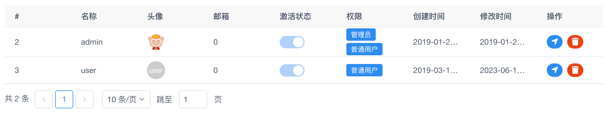
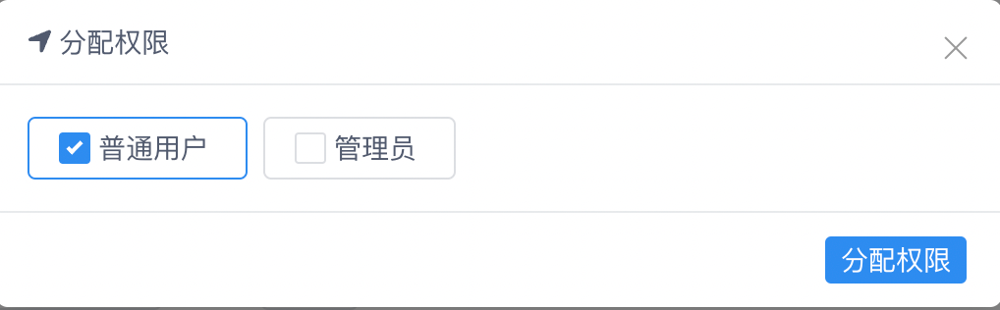
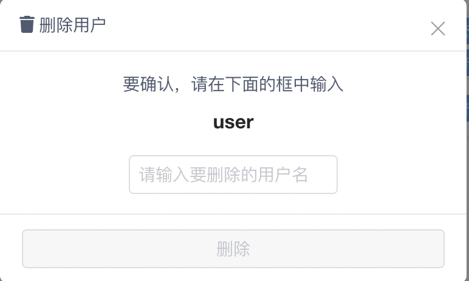
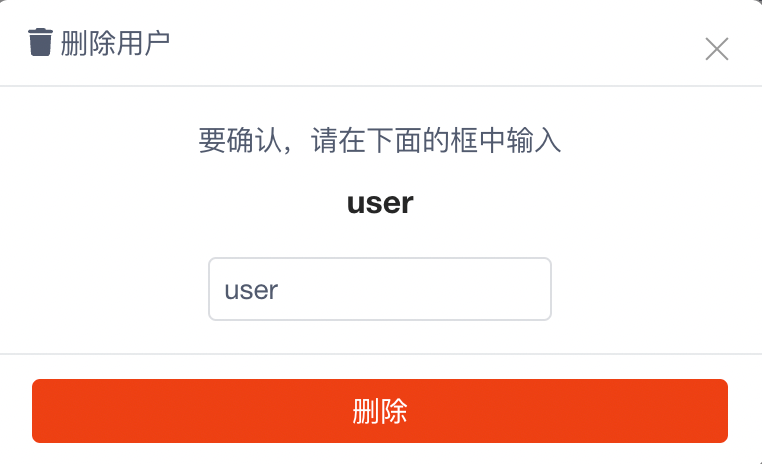

!!! note

    本文主要描述我们如何通过系统管理用户。

菜单默认的目录为：`系统管理` --> `用户管理`，点击后页面大概如下：

### 分配权限

---

点击每条数据的 `操作` 栏中的第一个按钮，系统会弹出分配权限页面，大致如下：

如果已经分配了权限，该页面会自动将已选择的权限选中，反之则为未选中状态。

我们选中特定的权限后点击底部的 `分配权限` 按钮即可进行权限分配。

!!! note

    权限分配成功后，页面会自动刷新。并且会关闭当前弹出的窗口。

### 删除用户

---

点击每条数据的 `操作` 栏中的第二个按钮，系统会弹出分配权限页面，大致如下：

如果我们需要确定删除用户，需要在输入框中输入需要删除的用户名，输入正确后页面大致如下：

删除按钮变为可用状态，点击 `删除` 按钮即可进行用户删除。

!!! note

    用户删除成功后，页面会自动刷新。并且会关闭当前弹出的窗口。
